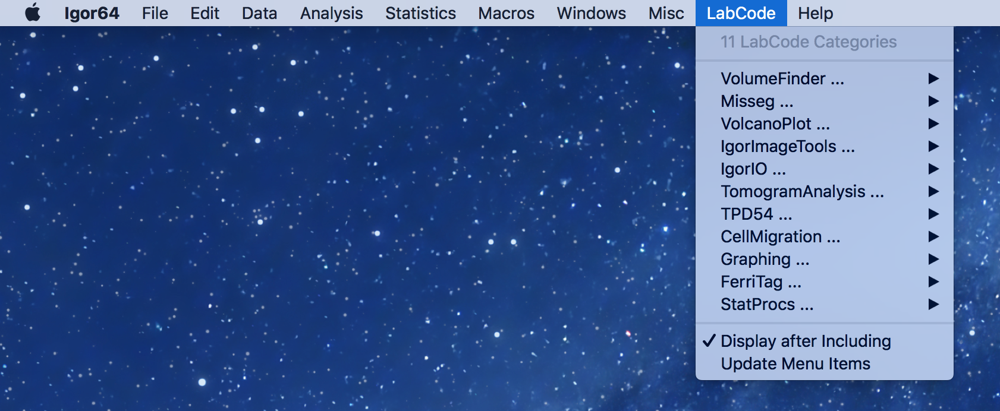
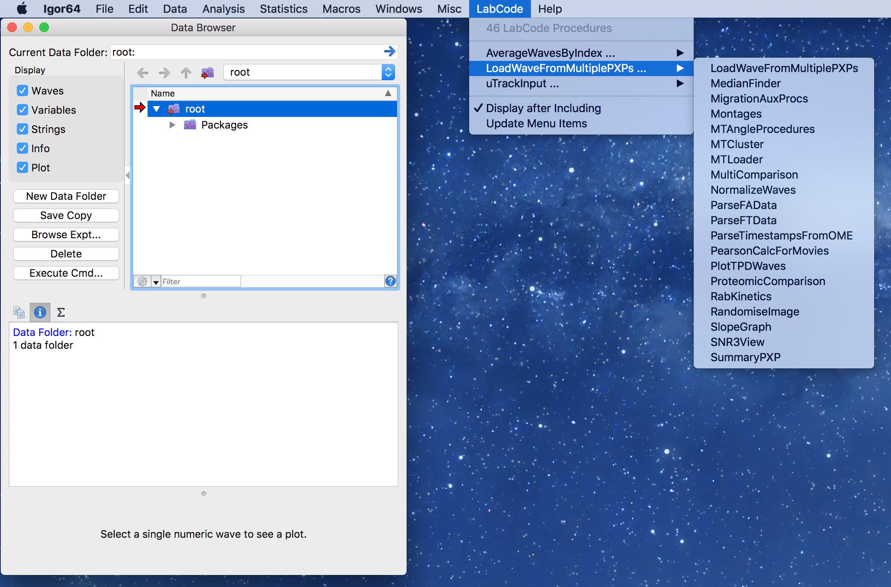

# IgorDistro
A cloud-based system to keep Igor code updated across multiple computers.

The code for this project was lifted from [Ryotako's excellent menu for loading WaveMetrics procedures](https://github.com/ryotako/Igor-WMProcMenu). I have modified it to give a "by folder" list of procedures for users to select. The main difference is in the way that the code is setup in Igor.

1. In Dropbox (or other cloud service) create a shared directory - any computer that will use the shared code must have access to this directory (you can make the users have read-only access if required).
2. Within this directory, create two directories: IP and UP.
3. Place the ipf file from this repo into IP.
4. Copy any code that you want to share with others into UP.
5. Now create two shortcuts (or aliases) to point to these folders. Do this on any computers that will share the code.

Shortcut/alias to the IP folder in

Mac: `/Users/<user>/Documents/WaveMetrics/Igor Procedures`

Windows: `C:\Users\<user>\Documents\WaveMetrics\Igor Procedures`

Shortcut/alias to the UP folder in

Mac: `/Users/<user>/Documents/WaveMetrics/User Procedures`

Windows: `C:\Users\<user>\Documents\WaveMetrics\User Procedures`

That's it! Start up Igor and the code will appear in a menu item called *LabCode*.

*For a categorical list of procedures:* organise your .ipf files into folders named by category, e.g. Statistics, Graphing, etc. Place the IgorDist.ipf in the IP folder.

*For an alphabetical list of procedures:* your .ipf files can be organised into folders or not, they will be listed in the menu in alphabetical order. Place the IgorDistAlphabetical.ipf in the IP folder.

**Important** - make sure that all computers have the appropriate Igor Licence. Support WaveMetrics by buying multi-seat licences if you would like to deploy your code to a team.

Tested in Igor Pro 7 and Igor Pro 8 on Mac and PC.